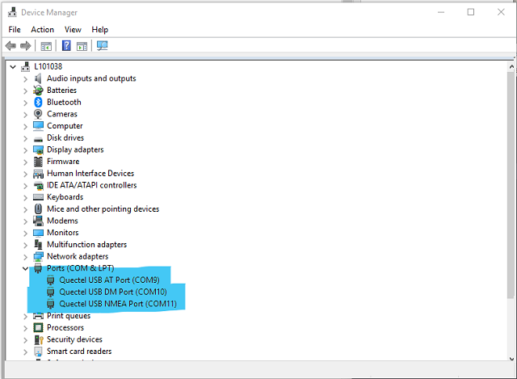

# Secure IoT Accelerator Program

The Secure IoT Accelerator program is intended to enable Canadian Internet of Things (IoT) ventures by providing them with global market reach capability with a Secure by Design technology.

For more information about the accelerator program, visit: https://www.l-spark.com/press-release/l-spark-telus-blackberry-and-solace-launch-accelerator-for-emerging-canadian-iot-ventures/

Youtube: https://www.youtube.com/watch?v=ZL2ADLHl-XQ&feature=youtu.be

IoT technical information session webinar: https://zoom.us/recording/share/PWJ3D-qfgsRB5TrQGfzrThJIY4mG5bUspvZ49OwiZNywIumekTziMw

# TELUS Shield BG96 Firmware Update

For participants the files referenced in this tutorial are stored in Blackberry Watchdox Workspace and you will given access when you attend the boot camp.

You will need windows machine to update the firmware.

1. Download and install **Quectel LTE Windows USB Driver V1** here: https://blackberry.watchdox.com/ngdox/workspaces/396793/Quectel_LTE_Windows_USB_Driver_V1

2. Download **Firmware Upgrade Files** from here: https://blackberry.watchdox.com/ngdox/workspaces/396793/BG96%20Firmware%20Upgrade

3. Unzip file **BG96MAR02A07M1G_01.011.01.011.zip**

4. Connect the USB cable your computer and BG96 Board.

5. Open **Windows Device Manager** and expand the **Ports (COM & LPT)** section

...

 
